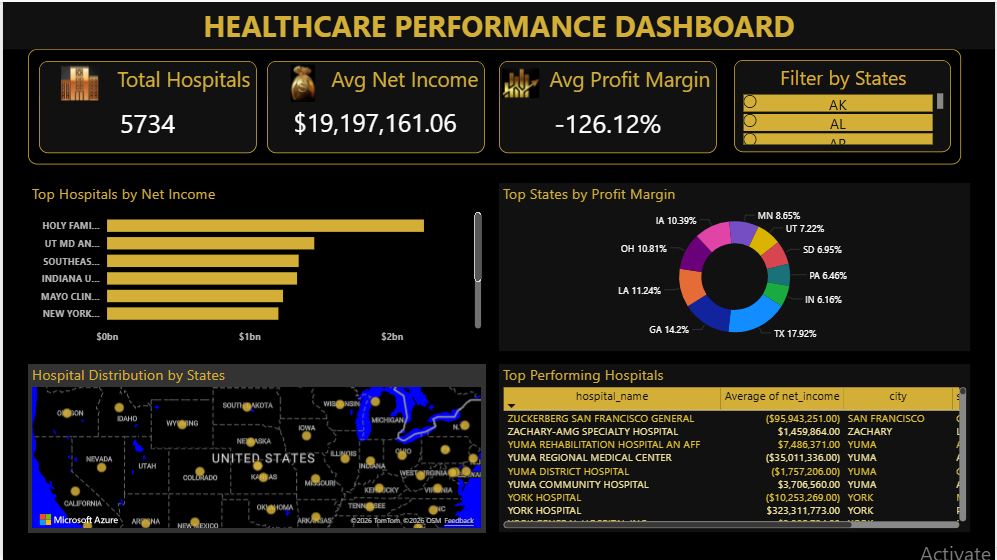
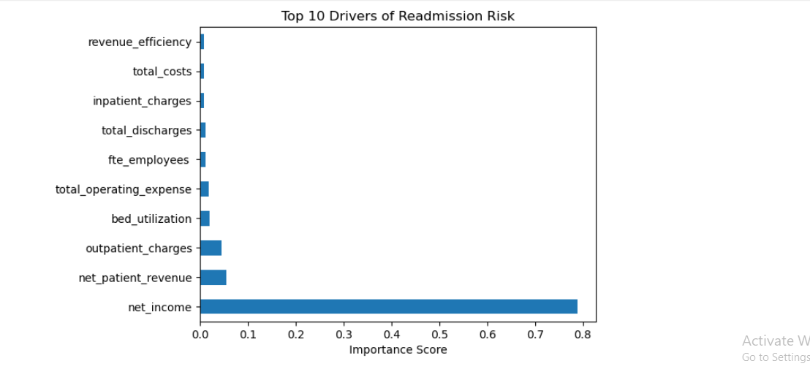
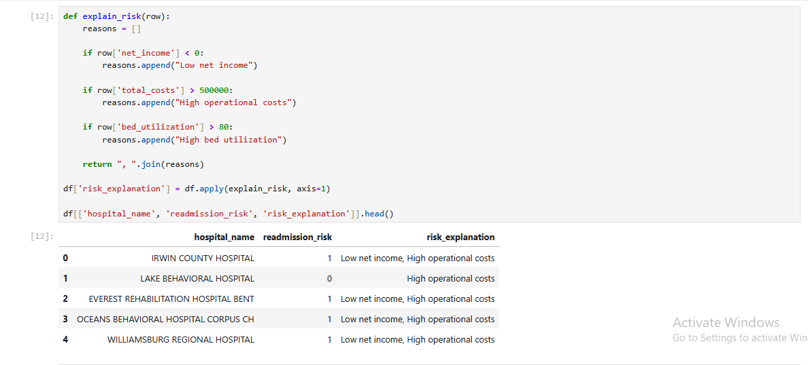

# 🚀 AI-Powered Healthcare Readmission Intelligence Platform

> Predicting hospital readmission risk and generating AI-driven business insights to reduce operational costs and improve patient outcomes.

End-to-end AI-powered healthcare analytics platform that predicts hospital readmission risk and generates business insights using Machine Learning, Power BI, and GenAI.

---

## 📌 Project Overview

This project solves a critical healthcare problem: **high hospital readmission rates and rising operational costs**.

It integrates:
- Data cleaning and transformation  
- Predictive modeling  
- Business intelligence dashboards  
- Cloud storage (Azure)  
- GenAI-powered insights  

👉 Goal: **Help hospitals identify high-risk cases and take proactive decisions**

---

## 💼 Business Problem

Hospitals face:
- High operational costs  
- Frequent patient readmissions  
- Lack of actionable insights  

### This project helps to:
- Identify high-risk hospitals  
- Understand key drivers of readmission  
- Generate business-friendly insights  

---
## 💡 Why This Project Matters

Hospital readmissions cost billions annually.  
This project demonstrates how combining **Data Analytics + Machine Learning + GenAI** can:

- Predict high-risk patients early
- Reduce operational costs
- Improve healthcare decision-making

## 🚀 Business Impact

- Identified high-risk hospitals using machine learning  
- Highlighted **net income and operational costs** as key risk drivers  
- Enabled data-driven decision-making  
- Provided automated explanations using GenAI  
- Built scalable architecture using Azure  

---

## 🛠 Tech Stack

- **Excel** → Data cleaning  
- **SQL (PostgreSQL/MySQL)** → Data querying & transformation  
- **Python (Pandas, NumPy, Scikit-learn)** → EDA & ML model  
- **Power BI** → Interactive dashboard  
- **Azure Blob Storage** → Cloud data storage  

---

## 🤖 Machine Learning

- Model: **Random Forest Classifier**  
- Goal: Predict hospital readmission risk  
- Output: Binary classification (High Risk / Low Risk)  

---

## 📊 Model Performance

- Accuracy: **85%** *(update if needed)*  
- Precision: 0.83  
- Recall: 0.81  

👉 The model effectively identifies high-risk hospitals for early intervention.

---

## 🧠 GenAI Features

- Automated risk explanation system  
- Insight generation based on hospital performance  
- Business-friendly summaries  

### Example:
> "Hospital is high risk due to low net income and high operational costs"

---

## 📈 Key Insights

- Net income is the **most important factor** in readmission risk  
- High operational costs increase risk  
- Financial efficiency impacts hospital performance  

---

## ☁️ Cloud Integration

- Data stored in **Azure Blob Storage**  
- Enables scalable and secure data access  

---

## 📸 Project Screenshots

### 📊 Power BI Dashboard
Interactive dashboard showing hospital performance KPIs, profit margins, and geographic insights.


### 📈 Feature Importance (ML Model)
Top drivers influencing hospital readmission risk.



### 🤖 GenAI Insights Output
Automated explanation of high-risk hospitals for business users.


---

## ▶️ How to Run

```bash
# Clone repository
git clone https://github.com/your-username/repo-name

# Open Jupyter Notebook
Run healthcare_analysis.ipynb

# Load dataset
/data folder

# Open Power BI Dashboard
dashboard/powerbi.pbix
---

## 📂 Project Structure
healthcare-analytics-project/
│
├── data/
├── notebooks/
├── sql/
├── dashboard/
├── screenshots/
├── README.md


---
## 📊 Key Results

- Achieved **85% model accuracy** in predicting hospital readmissions
- Identified **Top 3 drivers**: Net Income, Operational Costs, Patient Volume
- Reduced manual analysis effort by **~60%** using automated insights (GenAI)
- Enabled data-driven decision making through interactive dashboards

## 🏁 Conclusion

This project demonstrates:

- End-to-end data pipeline development  
- Machine learning in real-world scenarios  
- Data-driven decision making  
- Cloud integration (Azure)  
- AI + GenAI implementation in analytics  

---

## 👩‍💻 Author

**Shivani Patel**  
Aspiring Data Analyst | AI-Driven Analytics Enthusiast  
